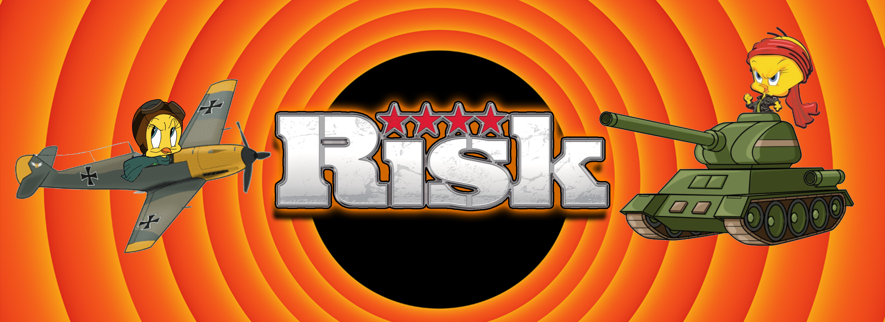

# ⚔️🗺 ️Risk 🗺⚔️

## 📋 Descripción del proyecto
RISK es originalmente un juego de mesa de estrategia por turnos creado por Hasbro®, que consiste en conquistar territorios a través del mundo. El objetivo es cumplir las misiones del jugador, o alcanzar la supremacia mundial atacando y capturando territorios enemigos.

El juego consta de 42 territorios geográficos a lo largo de todo el mapa, cada uno con un color distinto de acuerdo al continente al que pertenecen, pueden jugar de 2 a 6 personas.

---
## 🦾 Requerimientos
- Sistema operativo Linux o Windows
- Version de C++11
- 2 a 6 jugadores

---

## 🎮 Como se juega
Cada turno esta compuesto por tres etapas:

### Bonificacion
El juego comienza con la ocupación de los territorios en donde se distribuyen las tropas de cada jugador en los territorios que se le asignan dadas las cartas que le toquen, el jugador está en la libertad de distribuir sus tropas en los territorios que domina cuando recibe nuevas tropas. 

Al inicio de cada turno, el jugador recibe tropas en su ejercto. Las nuevas unidades que recibe se determinan por la cantidad de territorios/continentes/cartas que posea:
- **Territorios:** Cada 3 territorios el jugador recibe una tropa adicional.
- **Continentes:** Si el jugador ocupa todos los territorios de un continente, recibe una bonificación de acuerdo a la dificultad del continente:
    - **America del sur:** 2 tropas adicionales.
    - **Oceania:** 2 tropas adicionales.
    - **Africa:** 3 tropas adicionales.
    - **America del norte:** 5 tropas adicionales.
    - **Europa:** 5 tropas adicionales.
    - **Asia:** 7 tropas adicionales.
- **Cartas:** Cuando el jugador conquista territorios, gana cartas. Dependiendo de la combinación que posea podrá canjear determinados números de tropas. Si un jugador elimina a otro, podrá quedarse con las cartas para canjearlas.

Las bonificaciones son acumulativas dentro del mismo turno hasta que se canjean.

### Ataques
El jugador puede atacar cualquier territorio siempre y cuando:
- Sea un territorio vecino a uno de los territorios que posee el jugador.
- El jugador tenga más de una tropa en su territorio para poder atacar (una tropa siempre debe estar ocupando el territorio y no tiene permitido atacar a otros territorios).

Los resultados de las batallas se deciden al azar por los dados de la jugada, los dados de mayor valor se comparan y el que saque mayor valor destruye una tropa del contrincante, en caso de que se saque el mismo valor, el defensor es quien destruye una tropa. El mismo procedimiento se repite con los dados restantes.

El atacante puede atacar hasta con un máximo de tres tropas simultaneamente, el defensor tambien puede defenderse con tres tropas a la vez hasta que no tenga como defenderse, o cuando el atacante se rinda.

Cuando se logran derrotar todas las tropas de un territorio, el jugador debe moverse al nuevo territorio y reclamarlo.

### Fortificación
Antes de finalizar el turno, el jugador puede mover tropas de territorios siempre y cuando sea por territorios vecinos que el posea. Este proceso se repite hasta que un sólo jugador haya tomado control de los 42 territorios del tablero      

**Para más información del juego original, consulte el manual de RISK: [Manual Risk](https://www.hasbro.com/common/instruct/risk.pdf)**

---
## ⚙️ [Como funciona](Documentacion/ComoFunciona.md)
---

## 💻  Compilación y Ejecución
1. Compilación
   
        g++ -std=c++11 main.cpp -o risk
   
2. Ejecución
- **Linux**:

        ./risk
      
- **Windows**:

        risk.exe
  
---
## 💼  Integrantes

- [🐼 Nicolás Rincón Ballesteros](https://github.com/Rinconjr)
- [⚽ Santiago Yañez Barajas](https://github.com/SantiagoYB)
- [😎 Juan Diego Echeverry Plazas](https://github.com/JuanDiegoEcheverryP)

---
